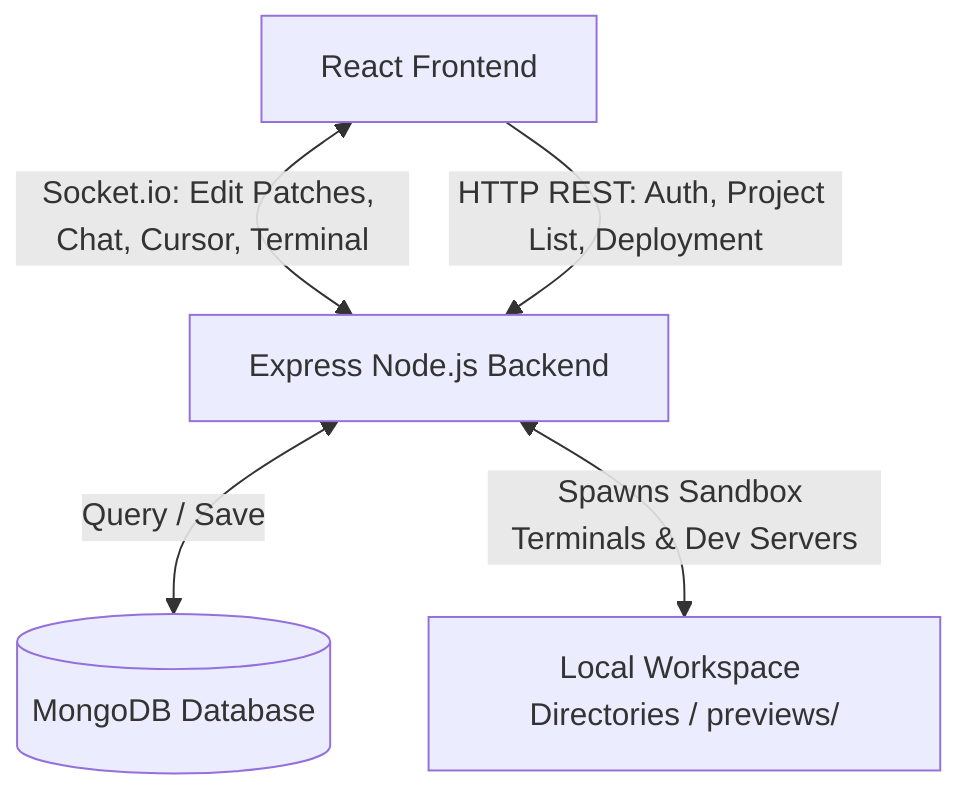

# Collab-Code

A web-based, real-time collaborative Integrated Development Environment (IDE) that lets multiple developers code together, chat, run shell commands, and preview their web projects — all from the browser.

---

## ✨ Features

- **Real-time Collaborative Editing** — Multiple users can join the same project room and edit files simultaneously. Code patches and cursor positions sync instantly across all connected clients.
- **Interactive File Tree** — Live-synced file tree supporting creation, renaming, and deletion of files/folders.
- **Simulated Terminal Panel** — A sandboxed in-browser terminal for running build scripts, npm commands, and general utilities within the workspace directory.
- **Dynamic Previews**
  - Static projects are served directly from the backend.
  - Node-based projects automatically run `npm install`, spin up a dev server on a dynamically allocated port, and render it in an iframe.
- **Integrated Project Chat** — In-IDE sidebar chat for real-time discussion with your team.
- **Presence & Avatars** — See who's online in the room and what they're working on.

---

## 🏗️ Architecture

Collab-Code follows a client-server architecture with real-time bidirectional communication over WebSockets (Socket.io) alongside RESTful API endpoints.



---

## 🛠️ Tech Stack

### Frontend
| Library | Purpose |
|---|---|
| React 19 & Vite | Component-driven UI with fast HMR bundling |
| Monaco Editor | VS Code's editor, embedded in the browser |
| Xterm.js | In-browser terminal emulator |
| Socket.io Client | Persistent channel for patches, cursors, presence, logs |
| React Resizable Panels | Resizable layout for tree/editor/terminal/chat |
| TailwindCSS + clsx/tailwind-merge | Styling |
| Radix UI + Lucide Icons | Accessible primitives & iconography |
| Motion | UI transitions and micro-interactions |
| React Router | Client-side navigation |
| Axios | REST API requests |

### Backend
| Library | Purpose |
|---|---|
| Node.js (ESM) | Runtime, using native `"type": "module"` syntax |
| Express (v5.x) | Routing, middleware, static file serving, CORS |
| Socket.io (Server) | Room-based real-time event handling |
| MongoDB & Mongoose | Application data storage and schema modeling |
| `diff` | Computes and applies text patches for collaborative editing |
| `jsonwebtoken` & `bcryptjs` | Auth: token signing and password hashing |
| `adm-zip`, `fflate`, `fs-extra` | File compression, exports, and safe recursive file ops |

---

## 📂 Project Structure

```
collab-code/
├── backend/
│   ├── app.js                   # Express application and server startup
│   └── src/
│       ├── Routes/              # REST endpoints (Auth, Projects, Chat, Git, Deploy, Run, Previews, Tree)
│       ├── controllers/         # Request handling logic per route
│       ├── models/              # MongoDB schemas (User, Project, ChatMessage, etc.)
│       ├── services/            # Business logic (Auth, GitHub, Previews, Port allocation)
│       └── socket/
│           └── socketHandler.js # Real-time sync, patch broadcasting, terminal streams
├── frontend/
│   ├── src/
│   │   ├── components/          # Reusable UI components
│   │   │   └── ide/             # CodeEditor, FileTree, TerminalPanel, SidebarChat
│   │   ├── pages/                # LandingPage, LoginPage, DashboardPage, IDE
│   │   └── lib/                  # Shared logic (API requests, config)
│   └── tailwind.config.js
```

---

## ⚙️ How It Works

### Real-Time Sync (`socket/socketHandler.js`)
- Tracks active rooms, users, and in-memory file versions.
- When a client sends a `code_patch` with a `baseVersion`, the server checks it against `serverVersion`:
  - **Match** → patch applied, version incremented, `code_patch_applied` broadcast to the room.
  - **Mismatch** → `conflict_detected` is emitted, triggering resynchronization.
- Files and tree state are periodically autosaved to MongoDB.

### Preview Service (`services/previewService.js`)
For projects with a `package.json`:
1. Allocates an available port.
2. Runs `npm install` if `node_modules` is missing.
3. Starts `npm run dev` / `npm start` on the allocated port.
4. Caches the running process per `roomId` for clean shutdown.

### Terminal Runner
- Executes commands from `TerminalPanel` on the backend.
- Restricted to each workspace's directory (`previews/<roomId>`) to sandbox the host machine.

---

## 🗄️ Database Models

| Model | Purpose |
|---|---|
| `User.js` | Login credentials, profile data, preferences |
| `Project.js` | File structure/metadata, tree layout, owner info, room config |
| `ProjectChatMessage.js` | Persisted sidebar chat history |
| `CodeRun.js` | Shell execution logs |
| `Deployment.js` | Static deployment records |

---

## 🚀 Getting Started

> Update this section with your actual setup steps, environment variables, and scripts.

```bash
# Clone the repo
git clone <your-repo-url>
cd collab-code

# Install backend dependencies
cd backend
npm install

# Install frontend dependencies
cd ../frontend
npm install

# Run backend
cd ../backend
npm run dev

# Run frontend
cd ../frontend
npm run dev
```

### Environment Variables

Create a `.env` file in `backend/` with at least:

```
MONGODB_URI=your_mongodb_connection_string
JWT_SECRET=your_jwt_secret
PORT=5000
```

---

## 🔐 Security Notes

- Terminal execution is sandboxed to per-room workspace directories — verify there's no path traversal possible (e.g. `cd ../../`, symlinks) before deploying publicly.
- Auth uses JWT + bcrypt; ensure secrets are stored securely and never committed.

---
